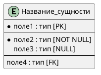
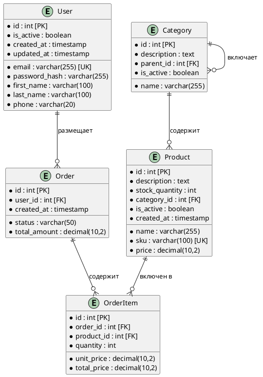

### 4.4. ER диаграмма (ERD)
**Инструкции по созданию ER диаграмм с PlantUML для ИИ агента**

#### 4.4.1. Содержание
1. [Основы синтаксиса](#основы-синтаксиса)
2. [Метрики качества](#метрики-качества)
3. [Валидационные правила](#валидационные-правила)
4. [Базовые элементы](#базовые-элементы)
5. [Типы связей](#типы-связей)
6. [Создание SQL скрипта](#создание-sql-скрипта)
7. [Лучшие практики](#лучшие-практики)
8. [Примеры сценариев](#примеры-сценариев)
9. [Чек-лист качества](#чек-лист-качества)

---

#### 4.4.2. Основы синтаксиса

##### 4.4.2.1. Базовая структура файла:


##### 4.4.2.2. Обозначения:
- `*` - обязательное поле (NOT NULL)
- `--` - разделитель секций  
- `[PK]` - первичный ключ
- `[FK]` - внешний ключ
- `[UK]` - уникальный ключ

---

#### 4.4.3. Метрики качества

##### 4.4.3.1. Целевые показатели:
- **Нормализация**: соответствие 3NF (третья нормальная форма)
- **Покрытие связей**: 100% FK должны быть связаны с PK
- **Именование**: единообразие названий сущностей и полей
- **Группировка полей**: логическое разделение на секции
- **SQL соответствие**: 100% соответствие ERD и SQL скрипта

##### 4.4.3.2. Система оценки:
- **Отличное качество**: 3NF + все связи + единообразие + SQL = ≥90%
- **Хорошее качество**: 2NF + большинство связей + SQL = 70-89%
- **Требует доработки**: проблемы с нормализацией или SQL = <70%

---

#### 4.4.4. Валидационные правила

##### 4.4.4.1. Автоматические проверки:
```
✓ Все сущности имеют первичный ключ [PK]
✓ Внешние ключи [FK] связаны с соответствующими [PK]
✓ Связи корректно типизированы (1:1, 1:N, N:M)
✓ Названия в единообразном стиле (snake_case или camelCase)
✓ Обязательные поля помечены символом *
✓ Соблюдена группировка полей (разделители --)
✓ SQL скрипт полностью соответствует ERD диаграмме
✓ Все таблицы в SQL имеют соответствующие сущности в ERD
```

---

#### 4.4.5. Базовые элементы

##### 4.4.5.1. Создание сущности с группировкой:
```plantuml
entity User {
  ' Первичный ключ
  * id : int [PK]
  --
  ' Основная информация
  * email : varchar(255) [UK]
  * password_hash : varchar(255)
  first_name : varchar(100)
  last_name : varchar(100)
  --
  ' Системные поля
  * created_at : timestamp
  * updated_at : timestamp
  deleted_at : timestamp
}
```

##### 4.4.5.2. Рекомендуемые секции:
1. **Первичный ключ** - всегда первым
2. **Основная информация** - бизнес-поля
3. **Связи** - внешние ключи
4. **Системные поля** - created_at, updated_at, deleted_at

---

#### 4.4.6. Типы связей

##### 4.4.6.1. Синтаксис связей:
| Тип связи | Синтаксис | Пример использования |
|-----------|-----------|---------------------|
| **1:1** | `\|\|--\|\|` | User ↔ UserProfile |
| **1:N** | `\|\|--o{` | Category → Products |
| **N:M** | `}o--o{` | Products ↔ Tags (через junction) |
| **1:0..1** | `\|\|--o\|` | User → PasswordReset |

##### 4.4.6.2. Примеры связей:

###### 4.4.6.2.1. Один к одному (1:1)
```plantuml
entity User {
  * id : int [PK]
  * email : varchar(255)
}

entity UserProfile {
  * user_id : int [PK, FK]
  * first_name : varchar(100)
  * last_name : varchar(100)
}

User ||--|| UserProfile : "имеет профиль"
```

###### 4.4.6.2.2. Один ко многим (1:N)
```plantuml
entity Category {
  * id : int [PK]
  * name : varchar(255)
}

entity Product {
  * id : int [PK]
  * name : varchar(255)
  * category_id : int [FK]
}

Category ||--o{ Product : "содержит"
```

###### 4.4.6.2.3. Многие ко многим (N:M) через junction table
```plantuml
entity Product {
  * id : int [PK]
  * name : varchar(255)
}

entity Tag {
  * id : int [PK]
  * name : varchar(255)
}

entity ProductTag {
  * product_id : int [PK, FK]
  * tag_id : int [PK, FK]
}

Product ||--o{ ProductTag
Tag ||--o{ ProductTag
```

---

#### 4.4.7. Создание SQL скрипта

##### 4.4.7.1. Обязательное требование:
**Вместе с каждой ERD диаграммой ОБЯЗАТЕЛЬНО создавать соответствующий SQL скрипт для реальной базы данных (предпочтительно SQLite).**

##### 4.4.7.2. Принципы соответствия ERD → SQL:
- **Каждая сущность** = таблица в SQL
- **Каждое поле ERD** = колонка в таблице
- **Связи ERD** = FOREIGN KEY в SQL
- **Типы данных** = соответствующие SQL типы

##### 4.4.7.3. Пример соответствия:

###### 4.4.7.3.1. ERD диаграмма:
```plantuml
entity User {
  * id : int [PK]
  * email : varchar(255) [UK]
  * password_hash : varchar(255)
  first_name : varchar(100)
  last_name : varchar(100)
  * created_at : timestamp
}

entity Order {
  * id : int [PK]
  * user_id : int [FK]
  * status : varchar(50)
  * total_amount : decimal(10,2)
  * created_at : timestamp
}

User ||--o{ Order : "размещает"
```

###### 4.4.7.3.2. Соответствующий SQL скрипт (SQLite):
```sql
-- Создание базы данных SQLite
-- Файл: database.sql

-- Таблица пользователей
CREATE TABLE users (
    id INTEGER PRIMARY KEY AUTOINCREMENT,
    email VARCHAR(255) NOT NULL UNIQUE,
    password_hash VARCHAR(255) NOT NULL,
    first_name VARCHAR(100),
    last_name VARCHAR(100),
    created_at TIMESTAMP DEFAULT CURRENT_TIMESTAMP
);

-- Таблица заказов
CREATE TABLE orders (
    id INTEGER PRIMARY KEY AUTOINCREMENT,
    user_id INTEGER NOT NULL,
    status VARCHAR(50) NOT NULL,
    total_amount DECIMAL(10,2) NOT NULL,
    created_at TIMESTAMP DEFAULT CURRENT_TIMESTAMP,
    FOREIGN KEY (user_id) REFERENCES users(id) ON DELETE CASCADE
);

-- Индексы для оптимизации
CREATE INDEX idx_users_email ON users(email);
CREATE INDEX idx_orders_user_id ON orders(user_id);
CREATE INDEX idx_orders_status ON orders(status);

-- Вставка тестовых данных
INSERT INTO users (email, password_hash, first_name, last_name) VALUES
('user1@example.com', 'hash1', 'Иван', 'Иванов'),
('user2@example.com', 'hash2', 'Петр', 'Петров');

INSERT INTO orders (user_id, status, total_amount) VALUES
(1, 'completed', 1500.00),
(1, 'pending', 750.50),
(2, 'completed', 2200.00);
```

##### 4.4.7.4. Соответствие типов данных:

| ERD тип | SQLite тип | Описание |
|---------|------------|----------|
| `int` | `INTEGER` | Целые числа |
| `varchar(n)` | `VARCHAR(n)` | Строки фиксированной длины |
| `text` | `TEXT` | Текст неограниченной длины |
| `decimal(m,n)` | `DECIMAL(m,n)` | Десятичные числа |
| `timestamp` | `TIMESTAMP` | Дата и время |
| `boolean` | `BOOLEAN` | Логический тип |

##### 4.4.7.5. Структура SQL файла:
1. **Комментарии** - описание назначения БД
2. **DROP TABLE** - для пересоздания (опционально)
3. **CREATE TABLE** - создание всех таблиц
4. **ALTER TABLE** - добавление внешних ключей (если нужно)
5. **CREATE INDEX** - индексы для производительности
6. **INSERT** - тестовые данные (минимум 2-3 записи на таблицу)

---

#### 4.4.8. Лучшие практики

##### 4.4.8.1. Именование
- **Сущности**: PascalCase или snake_case (единообразно)
- **Поля**: snake_case с понятными названиями
- **Связи**: осмысленные описания на русском языке

##### 4.4.8.2. Структурирование полей
```plantuml
entity Product {
  ' Первичный ключ
  * id : int [PK]
  --
  ' Основная информация
  * name : varchar(255)
  * description : text
  * sku : varchar(100) [UK]
  --
  ' Ценовая информация  
  * price : decimal(10,2)
  discount_price : decimal(10,2)
  --
  ' Связи
  * category_id : int [FK]
  * brand_id : int [FK]
  --
  ' Системные поля
  * is_active : boolean
  * created_at : timestamp
  * updated_at : timestamp
}
```

##### 4.4.8.3. Стилизация (опционально)
```plantuml
!define MAIN_ENTITY fill:#E3F2FD,stroke:#1976D2,stroke-width:2px
!define LOOKUP_ENTITY fill:#F3E5F5,stroke:#7B1FA2,stroke-width:2px
!define JUNCTION_ENTITY fill:#FFF3E0,stroke:#F57C00,stroke-width:2px

entity User <<MAIN_ENTITY>>
entity Role <<LOOKUP_ENTITY>>  
entity UserRole <<JUNCTION_ENTITY>>
```

---

#### 4.4.9. Примеры сценариев

##### 4.4.9.1. Система электронной коммерции


---

#### 4.4.10. Часто встречающиеся ошибки

##### 4.4.9.1. ❌ Неправильно:
```plantuml
' Отсутствует первичный ключ
entity User {
  email : varchar(255)
  name : varchar(100)
}

' Неправильная связь многие ко многим
User ||--o{ Role : "имеет роли"
```

##### 4.4.9.2. ✅ Правильно:
```plantuml
entity User {
  * id : int [PK]
  * email : varchar(255)
  * name : varchar(100)
}

entity UserRole {
  * user_id : int [PK, FK]
  * role_id : int [PK, FK]
}

entity Role {
  * id : int [PK]
  * name : varchar(100)
}

User ||--o{ UserRole
Role ||--o{ UserRole
```

---

#### 4.4.11. Чек-лист качества

##### 4.4.11.1. Структурная проверка:
- [ ] ✅ Все сущности имеют первичный ключ [PK]
- [ ] ✅ Внешние ключи [FK] корректно обозначены
- [ ] ✅ Обязательные поля помечены символом *
- [ ] ✅ Поля сгруппированы логически (разделители --)

##### 4.4.11.2. Проверка нормализации:
- [ ] ✅ **1NF**: Все поля атомарны (нет составных значений)
- [ ] ✅ **2NF**: Нет частичных зависимостей от составного ключа
- [ ] ✅ **3NF**: Нет транзитивных зависимостей

##### 4.4.11.3. Проверка связей:
- [ ] ✅ Связи 1:1 обоснованы и корректны
- [ ] ✅ Связи 1:N имеют FK в дочерней таблице
- [ ] ✅ Связи N:M реализованы через junction table
- [ ] ✅ Все FK ссылаются на существующие PK

##### 4.4.11.4. Проверка SQL скрипта:
- [ ] ✅ **SQL файл создан** и прилагается к ERD
- [ ] ✅ **Все таблицы** из ERD представлены в SQL
- [ ] ✅ **Типы данных** соответствуют ERD спецификации
- [ ] ✅ **Первичные ключи** корректно определены
- [ ] ✅ **Внешние ключи** созданы с правильными связями
- [ ] ✅ **Индексы** добавлены для FK и часто используемых полей
- [ ] ✅ **Тестовые данные** включены (минимум 2-3 записи на таблицу)
- [ ] ✅ **Синтаксис SQL** корректен для SQLite

##### 4.4.11.5. Качественная проверка:
- [ ] 🎯 Названия соответствуют бизнес-терминологии
- [ ] 🎯 Структура поддерживает все бизнес-процессы
- [ ] 🎯 Нет избыточности данных
- [ ] 🎯 Модель масштабируема

##### 4.4.11.6. Интеграционная проверка:
- [ ] 🔗 Сущности соответствуют объектам из Use Case
- [ ] 🔗 Связи отражают бизнес-правила
- [ ] 🔗 Поля покрывают все атрибуты из User Stories
- [ ] 🔗 SQL скрипт можно выполнить без ошибок

**Цель**: Создавать ERD диаграммы с готовым SQL скриптом для немедленного развертывания БД.

---

#### 4.4.12. Рекомендации по оптимизации

##### 4.4.12.1. Производительность:
- Индексы для часто используемых полей
- Денормализация для критичных запросов
- Партиционирование больших таблиц

##### 4.4.12.2. Поддержка:
- Говорящие названия полей и таблиц
- Комментарии для сложных связей
- Версионирование структуры

##### 4.4.12.3. Примеры финальной проверки:
✅ "Таблица users нормализована до 3NF"  
✅ "Связь orders → order_items реализована корректно"  
✅ "Все FK имеют соответствующие индексы"  
✅ "SQL скрипт выполняется без ошибок в SQLite"  

❌ "Таблица выглядит нормально"  
❌ "Связи работают"  
❌ "Данные сохраняются" 

